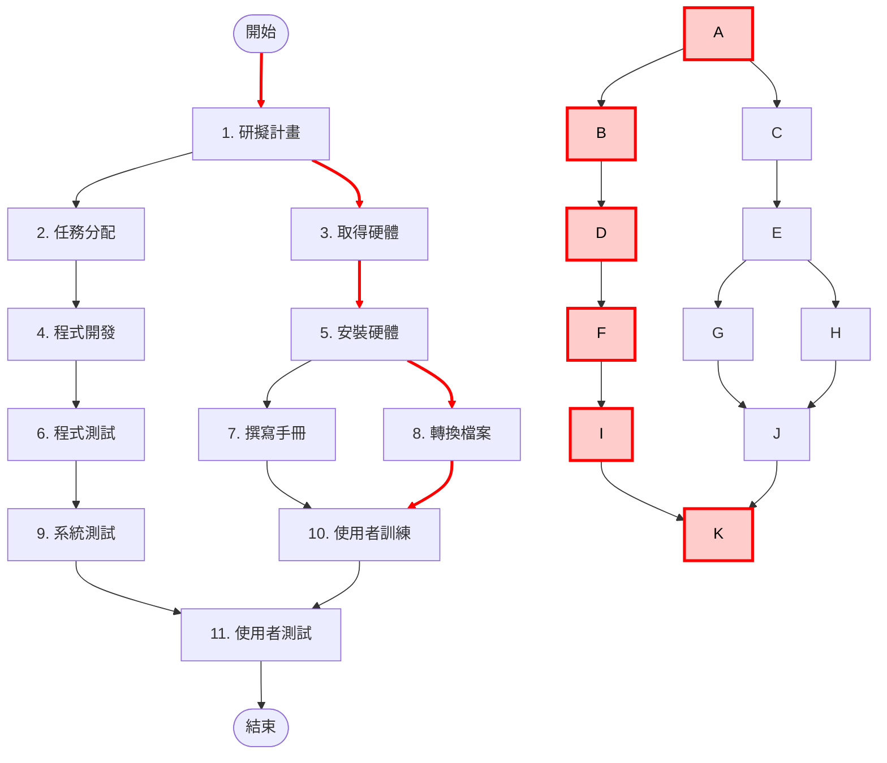
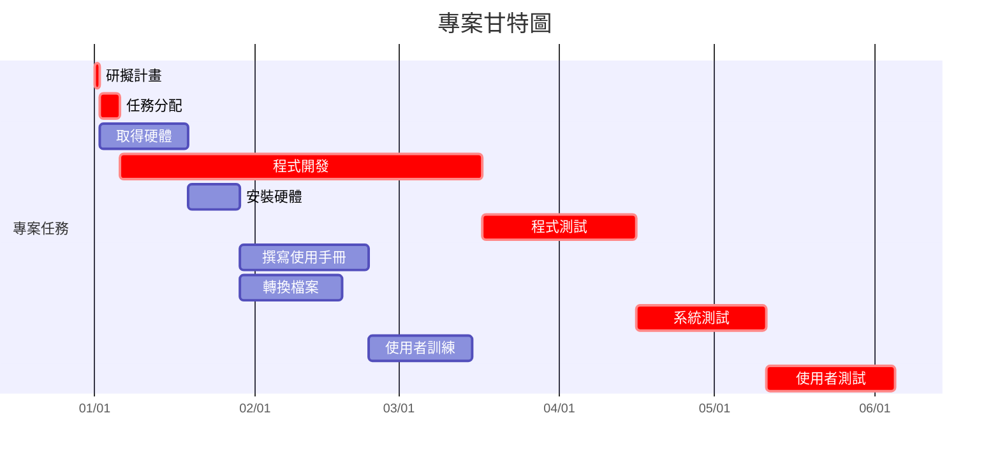

# 個人作業2：PERT/CPM、甘特圖與關鍵路徑

## 一、任務資料

| 任務 | 說明 | 需時（天） | 前置任務 |
|---|---|---:|---|
| 1 | 研擬計畫 | 1 | - |
| 2 | 任務分配 | 4 | 1 |
| 3 | 取得硬體 | 17 | 1 |
| 4 | 程式開發 | 70 | 2 |
| 5 | 安裝硬體 | 10 | 3 |
| 6 | 程式測試 | 30 | 4 |
| 7 | 撰寫使用手冊 | 25 | 5 |
| 8 | 轉換檔案 | 20 | 5 |
| 9 | 系統測試 | 25 | 6 |
| 10 | 使用者訓練 | 20 | 7、8 |
| 11 | 使用者測試 | 25 | 9、10 |

## 二、開始與結束時間

| 任務 | 說明 | 開始時間 | 結束時間 |
|---|---|---:|---:|
| 1 | 研擬計畫 | 第1天 | 第1天 |
| 2 | 任務分配 | 第2天 | 第5天 |
| 3 | 取得硬體 | 第2天 | 第18天 |
| 4 | 程式開發 | 第6天 | 第75天 |
| 5 | 安裝硬體 | 第19天 | 第28天 |
| 6 | 程式測試 | 第76天 | 第105天 |
| 7 | 撰寫使用手冊 | 第29天 | 第53天 |
| 8 | 轉換檔案 | 第29天 | 第48天 |
| 9 | 系統測試 | 第106天 | 第130天 |
| 10 | 使用者訓練 | 第54天 | 第73天 |
| 11 | 使用者測試 | 第131天 | 第155天 |

## 三、PERT/CPM 圖

紅色節點及紅色箭頭代表本專案的關鍵路徑：

**1 → 2 → 4 → 6 → 9 → 11**

## 四、甘特圖

甘特圖中紅色部分為關鍵路徑上的任務。

> 註：由於題目未提供實際專案開始日期，因此甘特圖以 2026/01/01 作為假設開始日期，主要用於呈現各任務的先後關係及工期。

## 五、關鍵路徑

本專案的關鍵路徑為：

**任務1 → 任務2 → 任務4 → 任務6 → 任務9 → 任務11**

即：

**研擬計畫 → 任務分配 → 程式開發 → 程式測試 → 系統測試 → 使用者測試**

關鍵路徑總工期為：

**1 + 4 + 70 + 30 + 25 + 25 = 155 天**

因此，本專案最短完成時間為 **155 天**。
